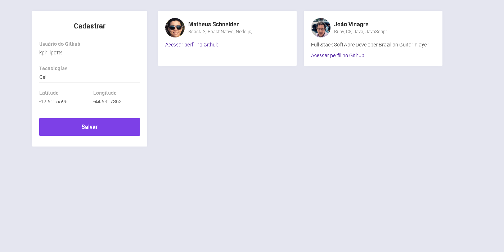

<h1 align="center">
  DevRadar
</h1>

<p align="center">
  

  
  
  <a href="https://github.com/Rocketseat/semana-omnistack-9/commits/master">
    
  </a>

  <a href="https://github.com/Rocketseat/semana-omnistack-9/issues">
    
  </a>

  
</p>

<p align="center">
  <a href="#description">Description</a>&nbsp;&nbsp;&nbsp;|&nbsp;&nbsp;&nbsp;
  <a href="#technologies">Technologies</a>&nbsp;&nbsp;&nbsp;|&nbsp;&nbsp;&nbsp;
  <a href="#prerequisites">Prerequisites</a>&nbsp;&nbsp;&nbsp;|&nbsp;&nbsp;&nbsp;
  <a href="#installing">Installing</a>&nbsp;&nbsp;&nbsp;|&nbsp;&nbsp;&nbsp;</p>

<p align="center">
  
</p>
<p >
  
  
</p>

## Description

Application designed to find developers geographically close to you and who have the same interests.

### Technologies

- [Node.js](https://nodejs.org/en/)
- [ReactJS](https://reactjs.org)
- [React Native](https://facebook.github.io/react-native/)
- [Expo](https://expo.io/)

### Prerequisites

The below softwares are needed, so if you need to install any of them, click on their link and follow the guide.

- [Installing Git](https://git-scm.com/downloads)
- [Installing Node.js via package manager](https://nodejs.org/en/download/package-manager/)
- [Installing Yarn](https://yarnpkg.com/en/docs/install#debian-stable)
- [Installing Expo](https://facebook.github.io/react-native/docs/getting-started)

### Installing

Follow the steps below to run the project on your computer. (using terminal or git bash)

1. Clone this repository

```
git clone git@github.com:gustavo-tp/dev-radar.git
```

2. Run Backend

```
cd dev-radar/backend
yarn
yarn dev
```

3. Run WEB App

```
cd ../frontend
yarn
yarn start
```

4. Run Mobile App

```
cd ../mobile
yarn
yarn start
```

Then open the Expo app on your phone and scan the QR code.
